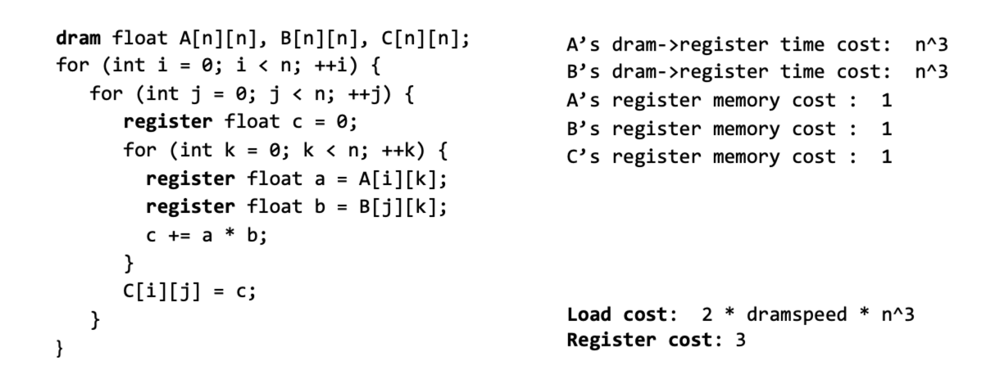
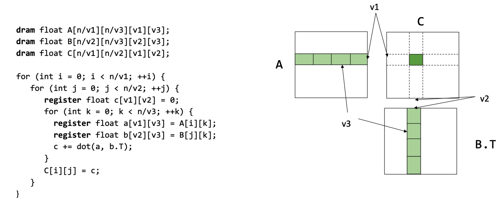
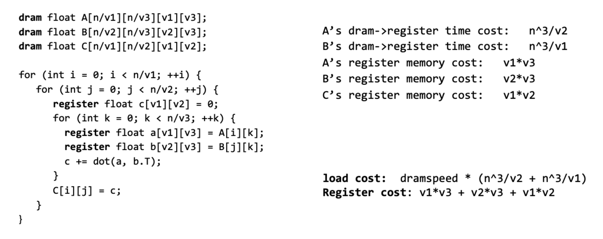
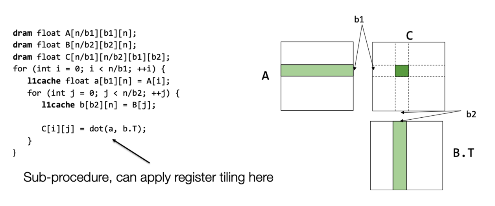
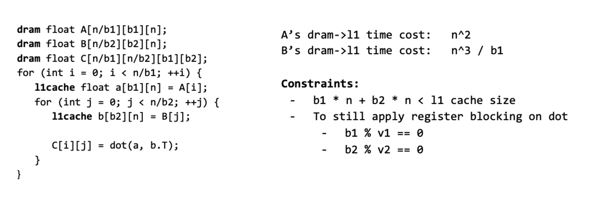
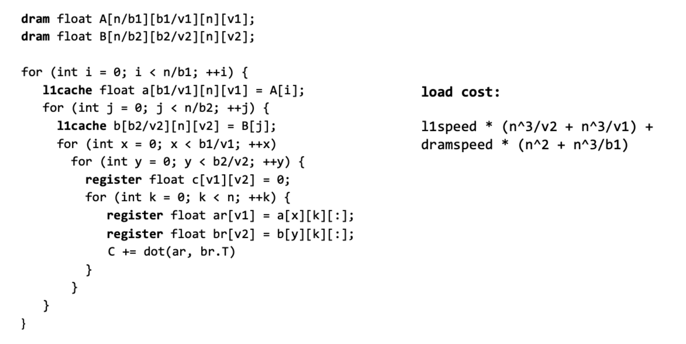

这一章主要介绍了如何在CPU上加速线性代数计算。

## 1. 通用加速方法

1. 向量化：CPU支持向量化计算

2. 数据存储方法：

   1. 行优先

   2. 列优先

   3. strides format：在第 $i$ 维上访问下一个元素需要在真实内存上跨越 $strides[i]$ 个元素，以二维矩阵为例，$A[i, j]=Adata[i\times A.strides[0] + j \times A.strides[1] + offset]$ 。

      * 使用strides format的好处在于，可以几乎免费的实现一些数据的变换，而不用改变数据的真实内存：
        1. 切片：通过改变offset和shape
        2. 交换轴：交换对应轴的stride
        3. 广播：插入一个等于0的stride

      * 使用strides format的坏处在于，它会是内存不在连续（或者说紧凑）：
        1. 向量化变得困难，所以在作业三中，调用所有的算子之前都调用了NDArray.compact()。这样其实是为了方便，如果追求效率，应该有些算子都不需要让内存紧凑，因为这需要申请新内存。同样，numpy中，reshape函数会隐式调用ascontiguousarray()。

3. 并行化：利用多核心和并行编程来并行计算。

## 2. 矩阵乘法加速案例

假设数据存储的方式是行优先，那么计算矩阵 $A$ 与矩阵 $B$ 的乘积中，需要不断调用 $A$ 的行和 $B$ 的列，但是 $B$ 的列在内存中不是连续的，这样就很难利用缓存来加速，所以可以改变问题形式，通过乘 $B$ 的转置来规避这个问题，这样内存中取的就是 $B$ 的行。因此，我们在之后的笔记中，将问题描述为：$\text{Computer}\ C = dot(A, B.T)$

cpu从缓存中取数据的耗时远小于从内存中取数据的耗时。在BLAS的线性代数库中，加速矩阵乘法的基本思想就是，利用缓存加载子矩阵，然后cpu从缓存中取数据，做子矩阵的乘法，从而减少cpu从内存中取数据的次数，从而加速计算。同时，因为子矩阵还可以有子矩阵，因此可以使用递归思想，将子矩阵加载到每一级缓存。

现在假设计算机拥有寄存器，L1 cache，dram三级存储。

1. 不做任何加速

   

2. 通过将子矩阵加载到寄存器中加速

   

   

   可以看出从dram->寄存器的取数据的次数变少了。这是因为，不做任何优化时， $A$ 中的每个元素要从内存到寄存器 $n$ 次，但是通过上述优化后，$A$ 中的每个元素只需要从内存到寄存器 $n/v2$ 次，相当于被复用了 $v2$ 次， $B$ 同理被复用了 $v2$ 次，因此我们可以适当调大 $v1,v2$ 的值，调小 $v3$ 的值。但是相对的，所需要的寄存器数量变大了。这时一种时间换空间的策略。

3. 通过将子矩阵加载到L1 cache中加速

   

   

   L1 cache相较于寄存器有更大的内存，因此可以存下一整行的子矩阵，从dram->l1取数据的次数更少了。

4. 将两者合并

   

这里采用前面说的技巧，将 $v3$ 设置尽可能小，这里为1。

矩阵乘法通用的复用技巧：

对于矩阵 $A[n][n], B[n][n], C[n][n]$ ， $C[i][j]=sum(A[i][k]\times B[i][k], axis=k)$，那么用 $v$ 平铺（tile，我的理解是采用多大的子矩阵）  $j$ 维度，那么就可以复用 $A$ 中元素 $v$ 次。