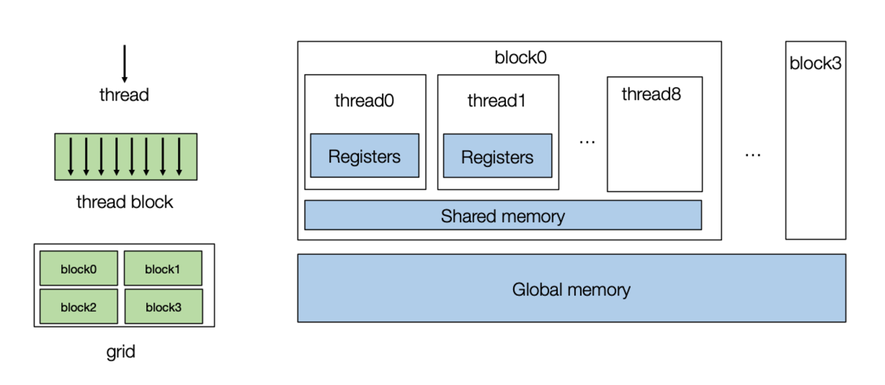
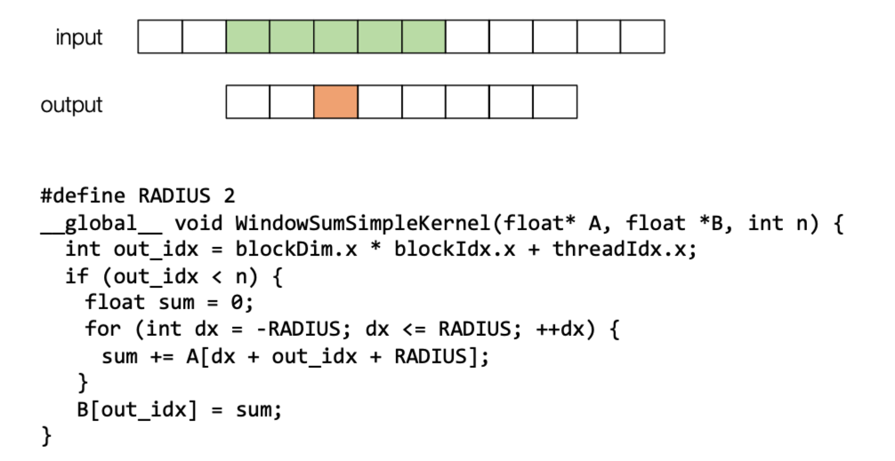
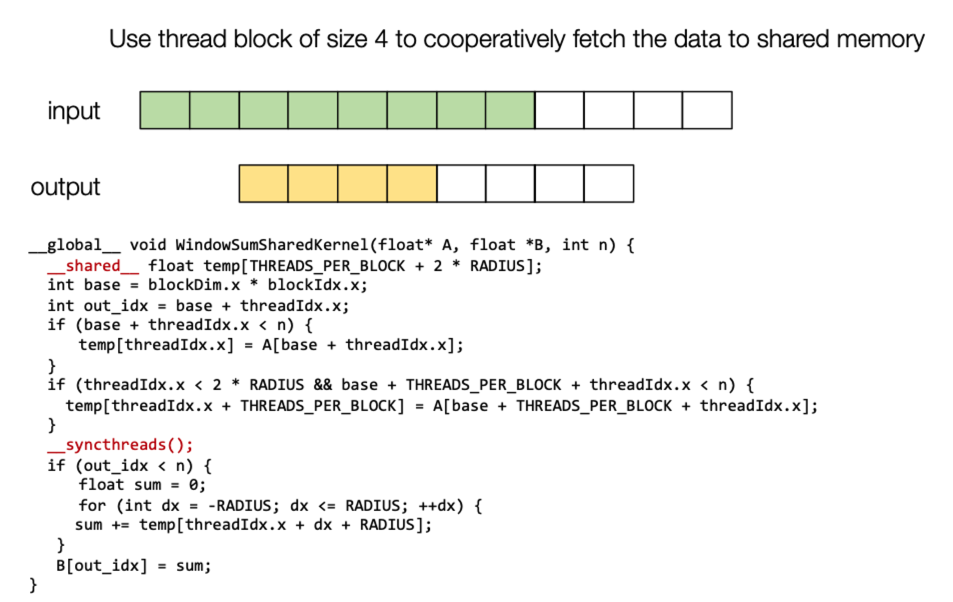
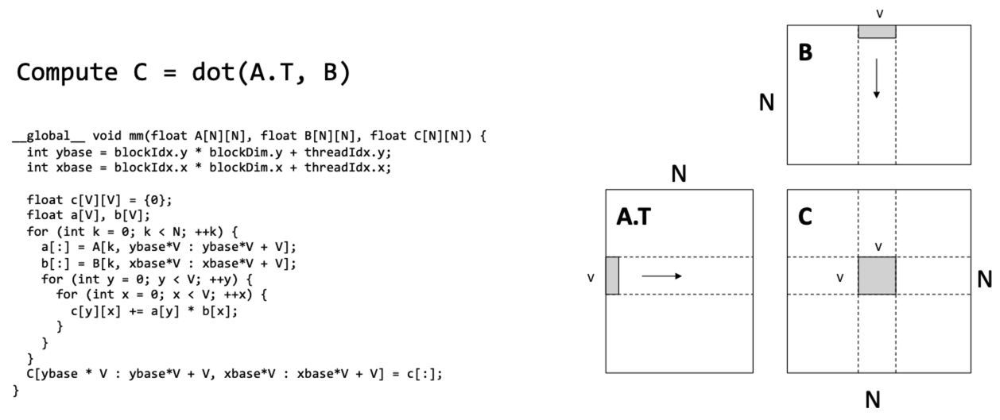
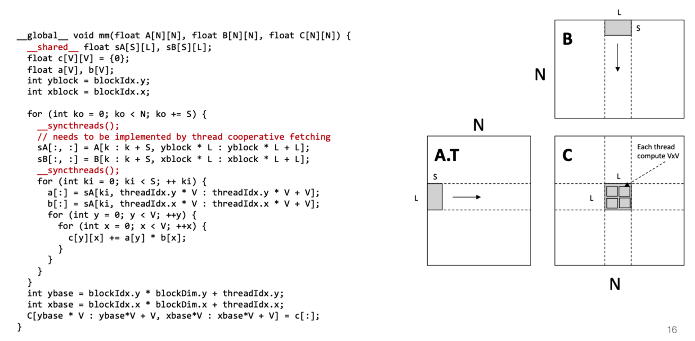
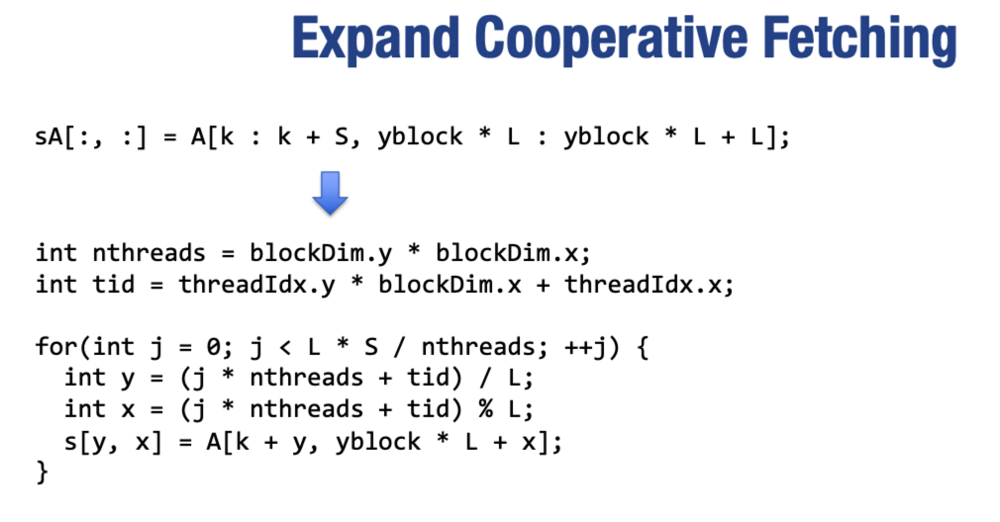

这一章主要介绍GPU的加速策略。

## GPU编程

1. GPU相对于CPU而言，最大的区别在于增加了大量的运算单元ALU。通常GPU的一个处理器（也叫做流式多处理器，Streaming Multiprocessor）包括数十甚至上百个简单的计算核，整个GPU可以达到上千个核。与CPU相比，每个核的结构简单了很多，通常不支持一些CPU中使用的较为复杂的调度机制。

2. CUDA中首先将一组线程（通常不超1024个）组成一个线程块（block），每个线程块中的线程又可以分成多个warp被调度到GPU核上执行，一个线程块可以在一个SM上运行。多个线程块又可以组成一个网格（grid）。线程块和网格分别通过一个3维整数类型描述其大小(`blockDim`和`gridDim`)，每个线程都可以通过`threadIdx`和`blockIdx`来确定其属于哪个线程块以及哪个线程

3. GPU的存储结构如下所示，一个block包含许多寄存器，可以给每个thread都分配一些寄存器。然后一个block有一个共享内存。最后一整块GPU有一个全局内存（显存）。

   

4. 使用共享内存加速案例：window sum

   

   显然相邻的thread对应的窗口几乎都是重叠的，这就启发我们把相邻的thread对应的窗口一起加载到一个block的共享缓存，减少从全局内存->寄存器取数据的次数。

   

## GPU 加速矩阵乘法

加速方式基本和上节课提到的CPU通过多级存储加速矩阵乘法类似，thread的寄存器对应cpu寄存器，共享内存对应L1 缓存，全局内存对应内存。这里采用矩阵 $A$ 的转置和上一章是同样的道理，为了尽可能使用连续内存。

1. 使用寄存器加速

   

   每个线程处理一个 $v\times v$ 的矩阵乘法，有 $N^2/v^2$个线程并行。$A$ 和 $B$ 从全局内存到寄存器的次数均为 $N^2/v$ 。

2. 使用共享内存和寄存器加速

   

   每个block处理一个 $L\times L$ 的矩阵乘法，有 $N^2/L^2$个block并行，每个thread处理一个 $v\times v$ 的矩阵乘法，每个block包含 $L^2/v^2$ 个thread。 $A$ 和 $B$ 从全局内存到共享内存的次数均为 $N^2/L$ ，从共享内存到寄存器的次数均为 $N^2/v$。

   同时对于每一个block的数据加载部分，也可以使用block中的thread并行提取。

   

   

除了上述优化之外，在GPU中实现一个高性能的矩阵乘还需要考虑其它优化：
1. bank冲突的优化
2. 软件流水线隐藏访存延时
3. 硬件指令（如Tensor Core）的利用

感觉兴趣的同学可以参考[CUTLASS的实现和优化过程](https://developer.nvidia.com/blog/cutlass-linear-algebra-cuda/)。